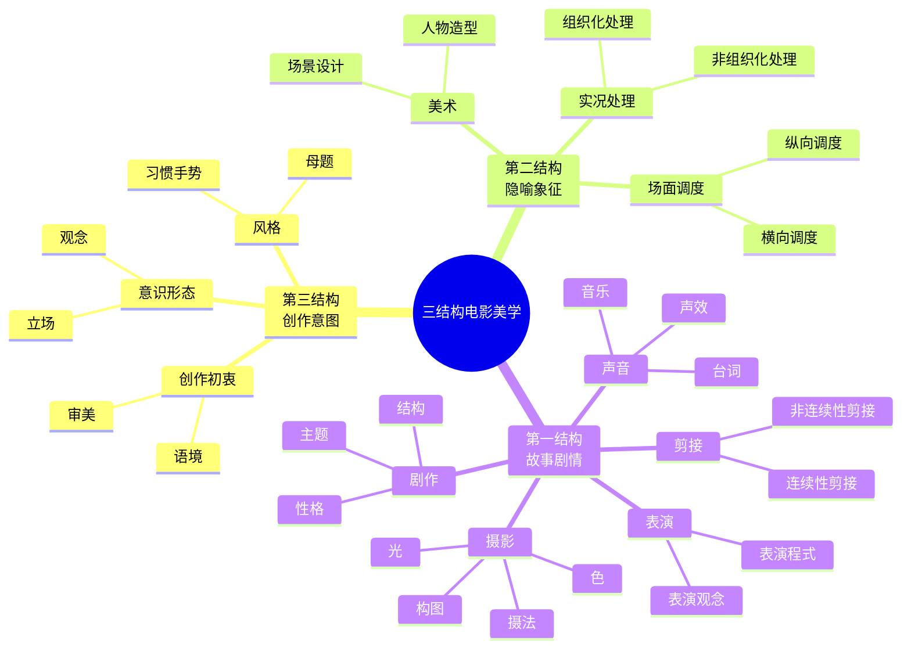

# 三结构电影美学

## 文本版本

### 第三结构 - 创作意图

**创作初衷**
- 审美
- 语境

**意识形态**
- 观念
- 立场

**风格**
- 习惯手势
- 母题

### 第二结构 - 隐喻象征

**美术**
- 场景设计
- 人物造型

**场面调度**
- 横向调度
- 纵向调度

**实况处理**
- 组织化处理
- 非组织化处理

### 第一结构 - 故事剧情

**剧作**
- 主题
- 结构
- 性格

**摄影**
- 光
- 色
- 构图
- 摄法

**声音**
- 台词
- 音乐
- 声效

**剪接**
- 连续性剪接
- 非连续性剪接

**表演**
- 表演观念
- 表演程式
